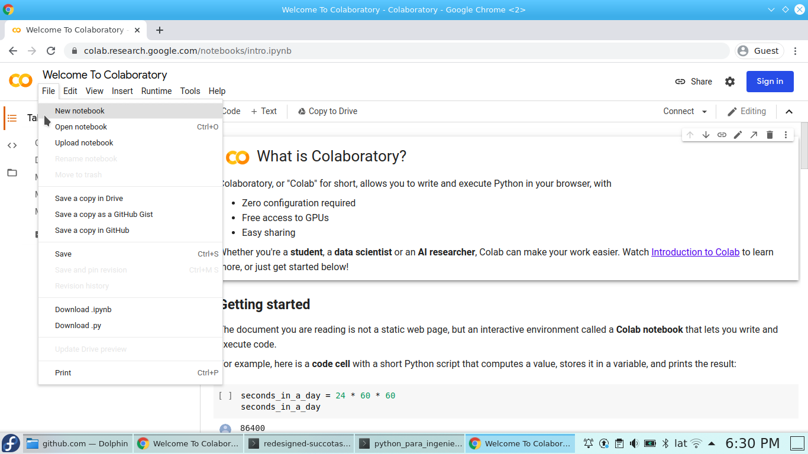
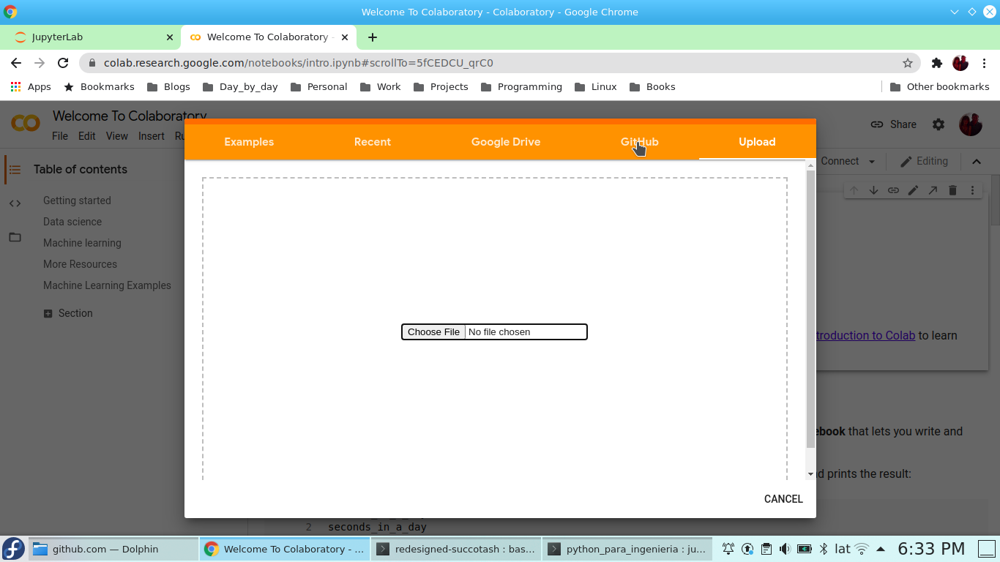

# didactic-spoon

Este es un curso de programación, empleando Python, para profesionales universitarios que
necesitan automatizar el procesamiento de información en su trabajo cotidiano.

Vamos a empezar trabajando en [Google Colab](https://colab.research.google.com/)

En [Google Colab](https://colab.research.google.com/) podemos hacer nuestros propios archivos

o podemos descargar archivos 

Vamos a descargar archivos del curso que están en [Github](https://github.com/DanielBerns/didactic-spoon)

Comenzaremos por el archivo 00-Introducción.ipynb

